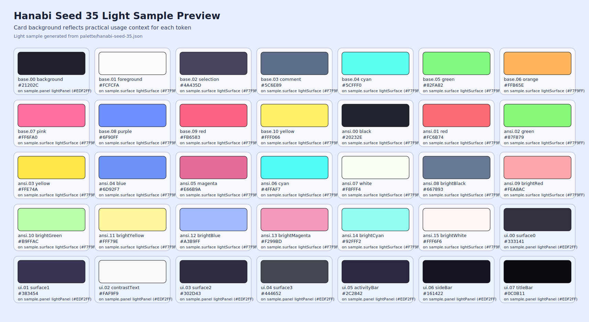

# Hanabi Theme

An original high-contrast theme family for terminals and editors (dark-first, with Dracula-style light aliases).


## Project Focus and Support Policy

This project is built first for the tools I personally use.
The main priority is making Hanabi easy to use from the Visual Studio Code side, including a smooth path for store distribution.

Support for other tools is best-effort.
If you open a clear issue with steps and environment details, I will try to handle it as time allows.
You can also contact me on X: [@okash1n](https://x.com/okash1n).

## Palette Preview

The project is built from a shared palette source.




- Palette source: `palette/hanabi-seed-35.json`
- Palette preview: `palette/hanabi-seed-35.svg`
- Light sample preview: `palette/hanabi-seed-35-light.svg`
- `hanabi-seed-35-light` is a visual sample for how Seed 35 accents may look in a light environment.
- Current distributed themes use a dark-first strategy; light variants are compatibility aliases unless noted otherwise.

## Supported Targets

| Target | Status | Directory |
| --- | --- | --- |
| Ghostty | Ready | `themes/ghostty` |
| iTerm2 | Ready | `themes/iterm2` |
| Terminal.app (macOS) | Ready | `themes/terminal-app` |
| [Visual Studio Code](https://marketplace.visualstudio.com/items?itemName=okash1n.hanabi-theme-vscode) | Ready | `themes/visual-studio-code` |
| Windows Terminal | Ready | `themes/windows-terminal` |
| Cursor | Ready | `themes/cursor` |
| Vim / Neovim | Ready | `themes/vim` |
| Zsh | Ready | `themes/zsh` |
| Obsidian | Ready | `themes/obsidian` |

## Dark / Light Support

| Target | Dark | Light | Notes |
| --- | --- | --- | --- |
| Ghostty | Yes | Yes | `hanabi-light` is a dark-palette alias |
| iTerm2 | Yes | Yes | `hanabi-light.itermcolors` is a dark-palette alias |
| Terminal.app (macOS) | Yes | Yes | `Hanabi Light` profile is a dark-palette alias |
| Visual Studio Code | Yes | Yes | `Hanabi Light` keeps the same dark palette |
| Windows Terminal | Yes | Yes | `hanabi-light.json` keeps the same dark palette |
| Cursor | Yes | Yes | `Hanabi Light` keeps the same dark palette |
| Vim / Neovim | Yes | Yes | `hanabi_light.vim` is a dark-palette alias |
| Zsh | Yes | Yes | light prompt files are dark-palette aliases |
| Obsidian | Yes | Yes | `.theme-dark` and `.theme-light` are intentionally unified |

## Install

Each target has its own installation guide.

- Ghostty: `themes/ghostty/INSTALL.md`
- iTerm2: `themes/iterm2/INSTALL.md`
- Terminal.app: `themes/terminal-app/INSTALL.md`
- Visual Studio Code: `themes/visual-studio-code/INSTALL.md`
- Windows Terminal: `themes/windows-terminal/INSTALL.md`
- Cursor: `themes/cursor/INSTALL.md`
- Vim / Neovim: `themes/vim/INSTALL.md`
- Zsh: `themes/zsh/INSTALL.md`
- Obsidian: `themes/obsidian/INSTALL.md`

## Repository Layout

```text
.
├── assets
├── images
├── palette
├── samples
└── themes
    ├── cursor
    ├── ghostty
    ├── iterm2
    ├── terminal-app
    ├── vim
    ├── visual-studio-code
    ├── windows-terminal
    ├── zsh
    └── obsidian
```

## Obsidian Theme

Hanabi includes an Obsidian app theme where dark and light base schemes intentionally render the same dark visual identity (Dracula-style).

- Required files for Obsidian community theme publishing:
  - `manifest.json`
  - `theme.css`
  - `versions.json`
- Store screenshot:
  - `images/obsidian-preview.png` (512x288)

To preview the theme in Obsidian, follow `themes/obsidian/INSTALL.md`.

## Notes

- This repository is monorepo-first (no submodules).
- Theme files are generated and curated from a shared Hanabi palette model.

## License

MIT. See `LICENSE`.
