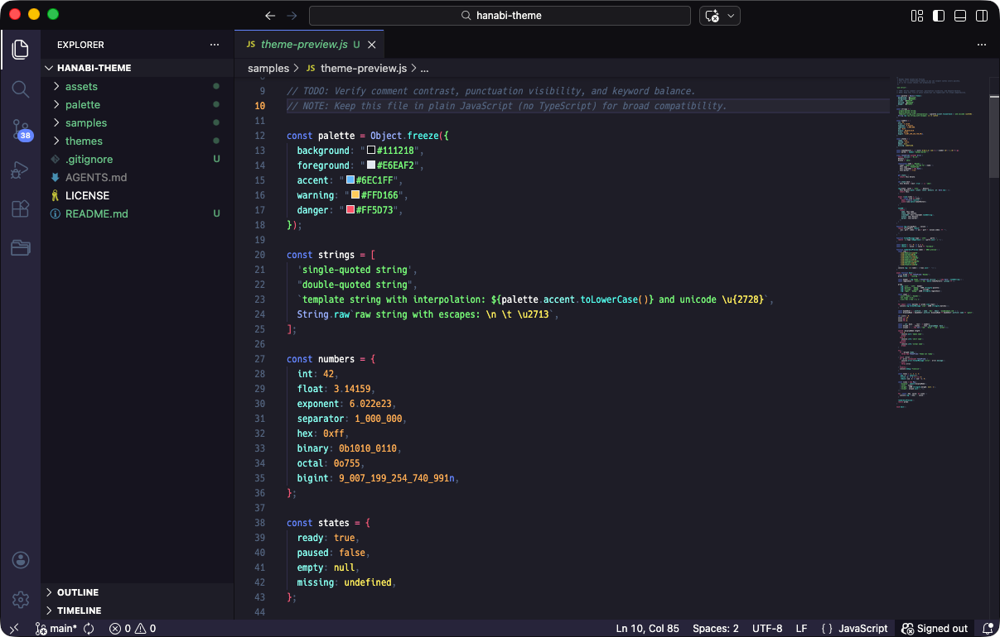

# Hanabi Theme for Cursor

Hanabi dark theme with a Dracula-style light alias (same dark palette).

## Activate

1. Open the Command Palette
2. Run `Preferences: Color Theme`
3. Select `Hanabi` (dark) or `Hanabi Light` (dark-palette alias)

## Palette

## Links

- Source: https://github.com/hanabi-works/hanabi-theme
- Issues: https://github.com/hanabi-works/hanabi-theme/issues
